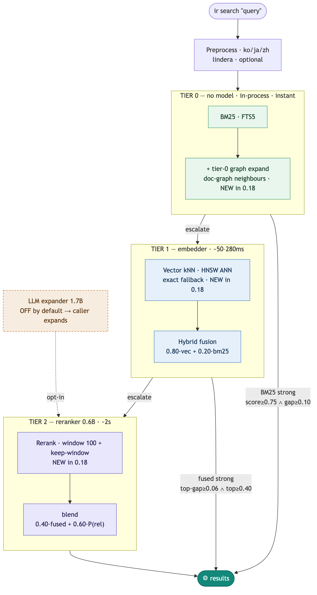

# ir

[](https://crates.io/crates/ir-search)
[](https://github.com/vlwkaos/ir/actions/workflows/ci.yml)
[](LICENSE)

[ENG](README.md) | [한국어](README.ko.md) | [中文](README.zh.md)

마크다운 지식베이스를 위한 로컬 시맨틱 검색. BM25 + 벡터 + LLM 재순위화를 전부 로컬 머신에서 수행 — 컬렉션당 SQLite 파일 하나, 퍼시스턴트 데몬이 모델을 메모리에 상주시키고, 모든 LLM 출력은 캐시된다.

```bash
brew install vlwkaos/tap/ir          # macOS
cargo install ir-search              # 모든 플랫폼 (바이너리 이름: ir)
```

```bash
ir collection add notes ~/notes      # 컬렉션 등록
ir sync notes                        # 텍스트 인덱스 + 벡터 임베딩
ir search "러스트 메모리 안전성"     # 검색 (데몬 자동 시작)
```

BM25 검색은 모델 없이 동작한다. 벡터/하이브리드 검색은 첫 사용 시 HuggingFace에서 모델을 자동 다운로드한다. 소스 빌드는 Rust 1.80+ 필요; macOS에서는 Metal이 자동 링크되고, Linux GPU 백엔드는 opt-in (`--features llama-cuda|llama-rocm|llama-vulkan`).

## 검색 동작 방식 — 어려운 쿼리에만 비용을 낸다

3개 티어. 각 티어는 **이전 티어가 확실하지 않을 때만** 실행되므로, 대부분의 쿼리는 티어 0 또는 1에서 반환되고 LLM을 건드리지 않는다. 하나의 웜 데몬이 모든 모델을 메모리에 유지하고, 모든 LLM 출력은 SQLite에 캐시된다.

<p align="center">
  
</p>

전처리기는 한국어·일본어·중국어 검색의 성패를 가르는 단계다: 색인 텍스트와 쿼리를 동일하게 형태소 단위로 토큰화하며, 없으면 CJK BM25 점수가 0에 가깝다.

**콜드 vs 웜** (M4 Max): 첫 쿼리는 데몬이 모델을 로드하는 ~3.0초, 이후 모든 쿼리는 ~30ms 왕복 — 콜드 스타트 중에도 BM25는 즉시 응답한다. **0.18**부터 HNSW ANN, 티어-0 그래프 확장, 넓은 재순위 윈도우가 기본 활성화되고, LLM 쿼리 확장기는 호출 에이전트로 위임된다 — 모두 [고급 설정](#고급-설정)에서 컬렉션별로 조정할 수 있다.

## 측정된 품질 (0.18 기본값, nDCG@10)

각 단계는 하나의 완전한 에스컬레이션 단계 — **쿼리가 그 단계에서 멈췄을 때**의 점수다. `BM25`와 `Vector`는 단일 신호 기준선이고, `Hybrid`는 둘을 융합하며(`0.80·vec + 0.20·bm25`, 티어 1), `+ Rerank`는 window-100 풀에 0.6B 재순위기를 더한다(티어 2). LLM 확장기는 **기본 비활성화**.

| 코퍼스 | BM25 | Vector | Hybrid | + Rerank |
|---|---|---|---|---|
| NFCorpus (en, 3.6k 문서, 323 쿼리) | 0.31 | 0.39 | 0.39 | 0.40 |
| FiQA (en, 57.6k 문서, 648 쿼리) | 0.24 | 0.40 | 0.40 | **0.44** |
| MIRACL-ko 50k (ko, 213 쿼리) | 0.73 | — | 0.92 | **0.96** |
| Allganize RAG-eval-KO (ko, 1.4k 페이지, 298 쿼리) | 0.70 | — | 0.69 | 0.72 |
| **중앙값 지연시간** (웜, M-시리즈) | ~1 ms | ~50 ms | ~50–280 ms | ~2 s |

`BM25`는 원시 FTS5이며, 0.18 기본 티어-0은 **doc-graph 확장**도 실행한다 — 희소 코퍼스(NFCorpus, `0.31 → 0.33`)에서 ≈ +0.02 nDCG@10, 밀집 코퍼스(FiQA)에서는 ~중립. FiQA는 BM25가 약해 `Vector ≈ Hybrid`이고, 재순위기가 실질 향상을 만든다(`0.40 → 0.44`). 한국어는 `ko` 전처리기가 전제다 (없으면 한국어 BM25 ≈ 0). 한국어 `Vector`는 여기서 재측정하지 않음(—).

## 버전 한눈에 보기

- **≤ 0.15** — 코어 파이프라인, 데몬, MCP, CJK 전처리기.
- **0.16** — `ir sync` (인덱스 + 임베딩 단일 명령), 자가 복구 증분 업데이트: 삭제된 파일은 완전히 제거되고, 이동/복원된 콘텐츠는 캐시된 벡터를 재사용.
- **0.17** — graph-expanded retrieval 연구 인프라와 선택적 HNSW ANN 인덱스, 대폭 빨라진 벤치마크 툴체인. **전부 기본 비활성화이며 검색 동작을 전혀 바꾸지 않는다** — opt-in 실험이지 내장 기능이 아니다. 컬렉션 DB에는 첫 쓰기 시 빈 테이블 2개가 추가되며, 0.16과 양방향으로 완전 호환.
- **0.18** — 위 연구 경로들이 **기본** 파이프라인이 된다: 벡터 검색용 HNSW ANN, 티어-0 그래프 확장, keep-window를 갖춘 넓은 재순위 윈도우, 그리고 기본에서 제거된 LLM 쿼리 확장기(확장은 호출 에이전트로 이관). 모든 항목은 `retrieval:` 설정 블록을 통해 컬렉션별로 조정할 수 있다 ([고급 설정](#고급-설정)). 마이그레이션은 매끄럽다 — 기존 컬렉션은 다음 `ir sync`에서 ANN 인덱스와 doc graph를 빌드하고 그 전까지는 정확 검색으로 폴백한다; 스키마 변경 없음. 근거와 측정 결과: [research/adr-0001-default-retrieval-pipeline.md](research/adr-0001-default-retrieval-pipeline.md). *(O(N·log N) graph-from-ANN 빌드는 0.18.x 후속 작업이며, 0.18.0은 기존 정확 패스로 그래프를 빌드한다.)*

## 문서

<details>
<summary><strong>모델</strong></summary>

모델은 첫 사용 시 HuggingFace Hub에서 자동 다운로드된다 (캐시: `~/.cache/huggingface/`). `HF_HUB_OFFLINE=1`로 다운로드를 비활성화한다.

| 모델 | 필요 기능 |
|---|---|
| [EmbeddingGemma 300M](https://huggingface.co/ggml-org/embeddinggemma-300M-GGUF) | 벡터 / 하이브리드 검색 |
| [Qwen3-Reranker 0.6B](https://huggingface.co/ggml-org/Qwen3-Reranker-0.6B-Q8_0-GGUF) | 재순위화 (선택) |
| [qmd-query-expansion 1.7B](https://huggingface.co/tobil/qmd-query-expansion-1.7B) | 쿼리 확장 (선택) |
| [BGE-M3](https://huggingface.co/ggml-org/bge-m3-Q8_0-GGUF) | 한국어 최적화 임베딩 대안 |

**로컬 모델 / 오버라이드:**

```bash
export IR_MODEL_DIRS="$HOME/my-models"
export IR_EMBEDDING_MODEL="$HOME/my-models/embeddinggemma-300M-Q8_0.gguf"
export IR_RERANKER_MODEL="$HOME/my-models/qwen3-reranker-0.6b-q8_0.gguf"
export IR_EXPANDER_MODEL="$HOME/my-models/qmd-query-expansion-1.7B-q4_k_m.gguf"
```

`IR_*_MODEL`은 `.gguf` 파일 경로, 알려진 모델이 들어 있는 디렉터리, 또는 HuggingFace 레포 ID를 허용한다. 탐색 순서: 환경변수 → `IR_MODEL_DIRS` → `~/local-models/` → `~/.cache/ir/models/` → HF Hub. `IR_COMBINED_MODEL`(확장+재순위 단일 모델)은 실험 전용 opt-in. 임베딩 모델을 바꾸면 `ir embed --force`가 필요하다.

**설정 디렉터리:**

```bash
export IR_CONFIG_DIR="~/vault/.config/ir"   # 이식 가능; ~ 및 $VAR 확장 지원
```

우선순위: `IR_CONFIG_DIR` → `XDG_CONFIG_HOME/ir` (deprecated) → `~/.config/ir`.

**GPU:** `IR_GPU_LAYERS=0`은 CPU 강제, `IR_GPU_LAYERS=N`은 부분 오프로드.

</details>

<details>
<summary><strong>한국어 임베딩 (BGE-M3)</strong></summary>

기본 EmbeddingGemma로도 한국어 하이브리드+재순위 성능은 충분히 높지만, 한국어 특화 dense retrieval이 필요하면 BGE-M3를 대체 임베더로 사용할 수 있다.

| | EmbeddingGemma | BGE-M3 |
|---|---|---|
| 파라미터 | ~150M | ~570M |
| 차원 | 768 | 1024 |
| GGUF (Q8_0) | ~300MB | ~600MB |
| 자동 감지 | 파일명 "embeddinggemma" | 파일명 "bge-m3" |

```bash
# HuggingFace에서 자동 다운로드
export IR_EMBEDDING_MODEL="ggml-org/bge-m3-Q8_0-GGUF"

# 또는 로컬 파일 (파일명에 "bge-m3" 포함 필수)
export IR_EMBEDDING_MODEL="$HOME/local-models/bge-m3-Q8_0.gguf"

# 기존 컬렉션 재임베딩 (차원 자동 변환)
ir embed <collection> --force
```

파일명에 "bge-m3"가 포함되면 CLS 풀링과 쿼리 프리픽스가 자동 적용되고, `ir embed --force` 시 벡터 테이블 차원도 자동 조정된다.

**참고:** 한국어 쿼리 확장(expander)은 비권장 — 영어 SFT 모델이라 MIRACL-Korean에서 오히려 성능이 소폭 저하된다. KURE-v1은 GGUF 변환이 검증되지 않아 실험적 (llama.cpp `convert_hf_to_gguf.py`로 직접 변환 필요).

</details>

<details>
<summary><strong>사용법</strong></summary>

**컬렉션 및 인덱싱:**

```bash
ir collection add notes ~/notes
ir collection ls
ir collection rm notes
ir status                    # 컬렉션별 인덱스 상태

ir sync [notes] [--force]    # 텍스트 인덱스 + 임베딩 (기본 유지보수 명령)
ir update [notes] [--force]  # 텍스트 인덱스만 — 빠름, 모델 불필요
ir embed [notes] [--force]   # 벡터 복구 / 재임베딩
```

인덱싱은 증분·내용 주소 방식(SHA-256)이다. 변경된 파일만 재처리하고, 동일 콘텐츠는 중복 제거하며, 삭제된 파일은 제거하고, 이동/복원된 콘텐츠는 재추론 없이 캐시된 벡터를 재사용한다.

**검색:**

```bash
ir search "러스트 메모리 안전성"                    # 하이브리드 (기본)
ir search "sqlite 아키텍처" --mode bm25            # 모델 불필요
ir search "비동기 패턴" --mode vector
ir search "에러 처리" -c notes --min-score 0.4

ir search "소유권" --json | --md | --files | --full | --chunk | --quiet
ir search "설계" -f "modified_at>=2026-01-01" -f "meta.tags=rust"
```

필터 절(`-f`, 반복 가능, AND 결합): 필드 `path`, `modified_at`, `created_at`, `meta.<name>`; 연산자 `=` `!=` `>` `>=` `<` `<=` `~` `!~`. 날짜는 UTC RFC3339로 정규화된다. 배열 프론트매터 필드는 **어느 한** 요소라도 조건을 만족하면 일치로 처리된다 (`!=` 포함).

**문서 조회:**

```bash
ir get "2026/Daily/2026-04-07.md"              # 정확 → 접미 → 부분 일치
ir get "2026-04-07" -c periodic --section "Log" --max-chars 3000
ir multi-get "a.md" "b.md" --json               # {found, not_found}
```

**데몬:**

```bash
ir daemon start|stop|status   # 첫 검색 시 자동 시작
```

웜 쿼리는 Unix 소켓 왕복 ~30ms. 콜드 스타트에서는 모델이 백그라운드에서 로드되는 동안 첫 쿼리가 BM25 결과를 즉시 반환할 수 있다.

</details>

<details>
<summary><strong>한국어 / 일본어 / 중국어 전처리기</strong></summary>

CJK 텍스트는 BM25 이전에 형태소 토큰화가 필요하다 — 없으면 교착어 형태가 형태소 단위 쿼리와 전혀 매칭되지 않는다 (한국어 BM25가 ~0.00에서 실용 수준으로 상승). 인덱싱 시와 쿼리 시 동일한 전처리기가 적용된다.

```bash
ir preprocessor install ko    # lindera + ko-dic (공식 바이너리; macOS/Linux)
ir preprocessor install ja    # lindera + ipadic
ir preprocessor install zh    # lindera + jieba
ir preprocessor bind ko wiki  # 컬렉션에 연결하고 재인덱싱
```

`ko` 바인딩 시 측정 기반 한국어 라우팅 기본값(`fused_strong_product: 0.05`)도 해당 컬렉션에 기록된다; 명시적 `routing:` 설정이 항상 우선한다. 컬렉션별 라우팅 오버라이드(`fused_strong_floor/product`, `bm25_strong_floor/gap`)는 `config.yml`에 두며, 검색에 포함된 모든 컬렉션이 같은 값일 때만 적용된다.

어떤 실행 파일이든 전처리기가 될 수 있다: stdin으로 UTF-8 라인 입력 → stdout으로 0 또는 1개의 토큰화된 라인 출력, 라인 간 프로세스 유지, ASCII 단일 단어 라인은 변경 없이 통과. lindera 처리량: M-시리즈 기준 한국어 문서 ~5,600개/초.

**효과** (MIRACL-Korean):

| 전처리기 | BM25 nDCG@10 |
|---|---|
| 없음 | 0.00 |
| lindera (`ko`) | 0.73 (50k 문서 샘플) |

</details>

<details>
<summary><strong>MCP 서버 — Claude Desktop / Claude Code</strong></summary>

```json
{ "mcpServers": { "ir": { "command": "ir", "args": ["mcp"] } } }
```

도구: `search` (`mode`, `limit`, `min_score`, `collections`, `filter` 지원), `get`, `multi_get`, `status`, `update`.

원격/멀티 클라이언트용 HTTP 모드:

```bash
ir mcp --http 3620 [--cors '*' | --cors 'https://app.example.com']
```

> HTTP 모드는 인증 없이 전체 인터페이스에 바인딩된다 — 신뢰할 수 있는 네트워크에서만 사용할 것.

</details>

<details>
<summary><strong>벤치마크 및 재현</strong></summary>

위의 모든 수치는 동봉된 하네스로 재현 가능하다:

```bash
scripts/bench.sh nfcorpus            # 모드별 전체 표, git 해시별 캐시
scripts/bench.sh miracl-ko --size 50000 --seed 42
bash scripts/preship.sh              # 픽스처 기반 안정성 / 속도 / 품질 게이트
```

실행은 재개 가능하고 (쿼리별 진행 상태가 크래시를 견딤) macOS에서는 메모리 감시기가 보호한다. 과거 BEIR 결과 (이전 파이프라인 설정): ArguAna에서 재순위화가 순수 벡터 대비 최대 +14.5% nDCG@10; 영어 코퍼스에서 융합 단독은 순수 벡터보다 유의미하게 낫지 않았다 — tier-2의 가치는 재순위기에 있다.

v0.17은 이 코퍼스들에서 탐구한 **기본 비활성화** 실험 연구 인프라를 포함한다: 재순위기 후보 풀을 넓히는 문서 유사도 그래프 (희소 결과 코퍼스에서 유의미), 그리고 근사 kNN용 선택적 HNSW 인덱스 (usearch) — 검증(MIRACL-ko 50k)에서 정확 검색과 top-10 일치율 99.2%, nDCG@10은 정확 검색과 동일. 기본 동작은 전혀 바뀌지 않는다; 세부 사항과 측정 결과는 `CHANGELOG.md` 참고.

</details>

<details>
<summary><strong>qmd와 비교</strong></summary>

ir은 [qmd](https://github.com/tobi/qmd)의 Rust 포트로, 저장소 모델이 다르고 퍼시스턴트 데몬을 갖췄다.

| | qmd | ir |
|---|---|---|
| 저장소 | 단일 SQLite | 컬렉션별 SQLite (`rm name.sqlite`로 삭제) |
| 프로세스 모델 | 쿼리마다 스폰 | 데몬이 모델 상주 유지 |
| LLM 캐시 | 재순위 점수 | 재순위 점수 + 확장기 출력 |
| 콜드 / 웜 쿼리 (M4 Max) | 9.5s / 840ms | **3.0s / 30ms** |

</details>

<details>
<summary><strong>개발 및 스키마</strong></summary>

```bash
cargo build [--release]
cargo test                   # 모델 불필요
cargo test -- --ignored      # 모델 의존 테스트
```

컬렉션별 스키마: `content` (해시 → 텍스트), `documents`, `documents_fts` (FTS5), `vectors_vec` (sqlite-vec, 코사인), `content_vectors` (청크 메타데이터), `llm_cache` (재순위 점수), `document_metadata` (프론트매터), `meta`, `doc_graph`, `ann_keys`. 전역 `expander_cache.sqlite`는 확장 출력을 캐시한다. 스테이지드 비동기 데몬 설계는 [research/pipeline.md](research/pipeline.md) 참고.

</details>

## 고급 설정

검색 파이프라인 동작은 `config.yml`의 `retrieval:` 블록에서 컬렉션별로(그리고 전역으로) 설정한다. 모든 필드는 선택 사항이며 — 생략하면 0.18 기본값이 적용된다. 해석 우선순위는 **`config > env > default`**: 여기에 설정한 값이 최종 권한을 가지며, 떠도는 환경변수에 조용히 덮어써지지 않는다.

```yaml
# ~/.config/ir/config.yml

# 전역 (데몬): 인프로세스 LLM 쿼리 확장기 로드 여부
retrieval:
  expander: false            # 0.18 기본값 — 확장은 호출 에이전트의 몫

collections:
  - name: notes
    path: ~/notes
    # 컬렉션별 파이프라인 오버라이드
    retrieval:
      ann: true              # 벡터 kNN용 HNSW ANN (미빌드 시 정확 검색으로 폴백)
      t0_graph_expand: true  # 티어-0 doc-graph 시드 확장
      rerank_window: 100     # 재순위기로 보내는 후보 수
      rerank_keep_window: true
```

| 키 | 범위 | 0.18 기본값 | 의미 |
|---|---|---|---|
| `ann` | 컬렉션 | `true` | 벡터 검색용 HNSW ANN 인덱스; 없거나 오래되면 정확 브루트포스로 폴백. |
| `t0_graph_expand` | 컬렉션 | `true` | BM25 시드가 `doc_graph` 이웃을 티어-0 후보 목록으로 끌어온다. |
| `rerank_window` | 컬렉션 | `100` | 티어-2 재순위기로 보내는 후보 수. |
| `rerank_keep_window` | 컬렉션 | `true` | 판정된 문서를 미판정 꼬리보다 위에 유지. |
| `expander` | 전역 | `false` | 인프로세스 LLM 쿼리 확장기 로드; 아니면 확장은 호출자에게 위임. |

함께 검색되는 컬렉션들은 컬렉션별 값이 **일치**해야 적용된다; 충돌하면 기본값으로 폴백한다 (`routing:`과 동일한 규칙). `ir sync` / `ir embed`는 해당 노브가 켜져 있을 때 ANN 인덱스와 doc graph를 빌드한다 (빈 컬렉션은 건너뜀). 컬렉션을 0.18 이전 검색 동작으로 되돌리려면 `ann: false`, `t0_graph_expand: false`, `rerank_window: 20`, `rerank_keep_window: false`, 그리고 전역 `expander: true`로 설정한다.

**대체 설정 파일** — 데이터 디렉터리를 옮기지 않고(컬렉션과 캐시는 그대로) 다른 `config.yml`을 `ir`에 지정하여, 하나의 임베딩된 코퍼스 위에서 여러 파이프라인 설정을 비교할 수 있다:

```bash
ir --config-path ./variant.yml search "query" -c notes
```

우선순위: `--config-path` > `IR_CONFIG_FILE` > `<config-dir>/config.yml`.

## 라이선스

[MIT](LICENSE)
