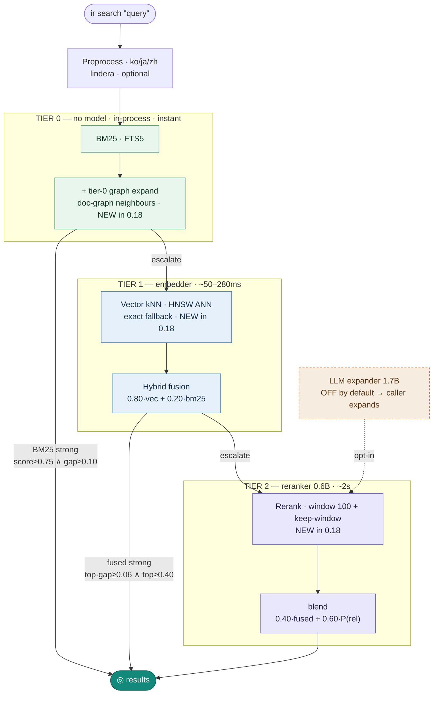

# ir — Search Pipeline

## Pipeline at a glance (0.18 defaults)

Three-tier escalation. Each tier runs only if the previous tier's signal isn't
strong enough, so cheap queries stay cheap. 0.18 defaults: ANN on, tier-0 graph
expansion on, rerank window 100 + keep-window on, LLM expander off (delegated to
the caller).



## Staged Async Daemon Design

BM25 runs in-process immediately. Daemon starts in background and signals readiness in two tiers. Client escalates only as far as the query needs.

```
ir search "query"
        │
        ▼
┌─────────────────────┐
│  BM25  (FTS5)       │  no model · in-process · instant
└──────────┬──────────┘  daemon starts in background
           │
     strong signal?         score ≥ 0.75  ∧  gap ≥ 0.10
     ───────yes─────────────────────────────────────────► return
                                               daemon warms in background
           │ no
           ▼
  ┌─────────────────────────────┐
  │  wait: Tier 1               │
  │  Embedder (EmbeddingGemma)  │  ~1s on M-series
  └──────────┬──────────────────┘
           │
┌──────────┴──────────┐
│  Hybrid Score-Fusion │  0.80·vec + 0.20·bm25  →  fused
└──────────┬──────────┘
           │
     strong enough?  ──yes──────────────────────────────► return
     no expander?    ──yes──────────────────────────────► return
                                               daemon finishes loading
           │ no
           ▼
  ┌────────────────────────────────────────────┐
  │  wait: Tier 2                              │
  │  Expander (qmd-1.7B) + Reranker (0.6B)    │  ~3–5s on M-series
  └──────────┬─────────────────────────────────┘
           │
┌──────────┴──────────┐
│  Query Expansion    │  original query → lex / vec / hyde sub-queries
└──────────┬──────────┘
           │
           ├─── lex sub-queries ──► BM25 (FTS5) ─────────────────┐
           │                                                       │
           ├─── vec sub-queries ──► kNN (batch embed) ────────────┤
           │                                                       │
           ├─── hyde sub-queries ─► kNN (batch embed) ────────────┤
           │                                                       │
           └─── fused (from score-fusion above) ──────────────────┤
                                                                   │
                                                                   ▼
                                                        ┌─────────────────┐
                                                        │   RRF merge     │
                                                        └────────┬────────┘
                                                                 │
                                                        ┌────────┴────────┐
                                                        │   Reranking     │  top-20
                                                        │                 │  0.40·fused + 0.60·P(relevant)
                                                        └────────┬────────┘
                                                                 │
                                                                 ▼
                                                              results
```

### Tier Model Requirements

| Tier | Models | Enables |
|------|--------|---------|
| 0 (instant) | none | BM25 only |
| 1 | Embedder | Vector, hybrid score-fusion |
| 2 | Expander + Scorer | Query expansion + reranking |

Note: expander without scorer is a no-op (expansion skipped if no reranker — `hybrid.rs:112`).

### Strong-Signal Shortcut

Raw BM25 score ≥ 0.75 AND gap ≥ 0.10 → skip all LLM work. Implemented in `src/search/hybrid.rs:is_bm25_strong_signal`. Fires rarely on non-English corpora (BM25 near-zero for Korean etc.) — those always escalate to Tier 1 minimum.

---

## Implementation

Staged async model load, two readiness signals:

```
embedder load → bind socket → write tier1 (PID) → [background] expander+reranker load → write tier2
```

Client waits up to 3s for socket (tier 1), then up to 7s for tier2 signal if hybrid mode needs it.

---

## Schema

Each collection DB (`~/.config/ir/collections/<name>.sqlite`):

```
content          — hash → full text (content-addressed, SHA-256)
documents        — path, title, hash, active flag
documents_fts    — FTS5 virtual table (porter tokenizer)
vectors_vec      — sqlite-vec kNN (768d cosine, EmbeddingGemma format)
content_vectors  — chunk metadata (hash, seq, pos, model)
llm_cache        — reranker score cache (sha256(model+query+doc) → score)
meta             — collection metadata (name, schema version)
```

Global cache (`~/.config/ir/expander_cache.sqlite`):

```
expander_cache   — sha256(model+query) → JSON Vec<SubQuery>
```

Triggers keep `documents_fts` in sync with `documents` on insert/update/delete.
